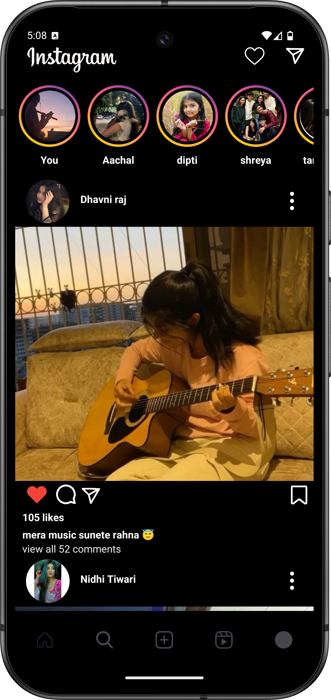
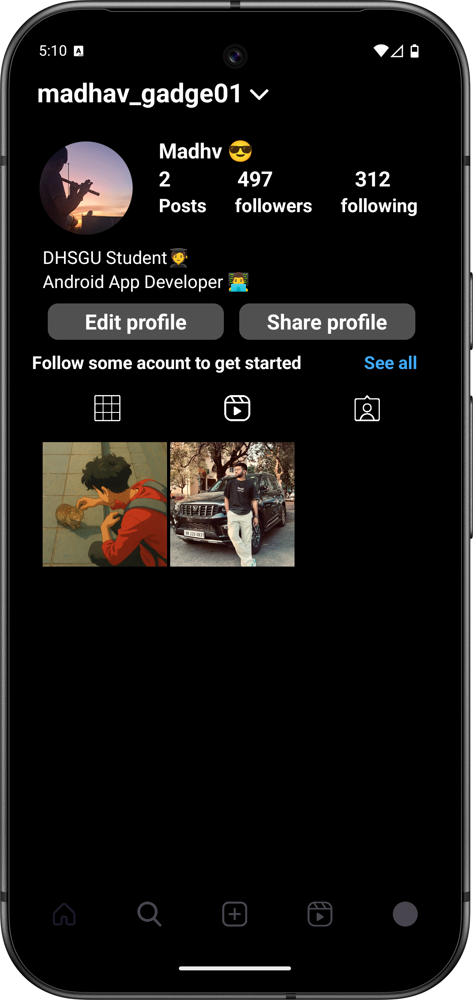

# 📸 Instagram Clone - Android App

A basic clone of the popular Instagram app, built using **Java** and **Android Studio**. It includes core features like user profiles, post feeds and a sleek UI inspired by Instagram's clean design.

---

## ✨ Features

- 🧍 User profile screen with posts
- 🖼️ Image feed with like buttons
- 🔎 "Explore" Activity
- 📷 ImageView for posts 
- 📱 Clean and responsive UI using ConstraintLayout,LinearLayout
- 📁 Organized project structure (Adapters, Data, Activities,recyclerview)
---

## 🛠️ Built With

- Java
- Android Studio
- RecyclerView
- ConstraintLayout
---
## 👨‍💻 Author
-[Madhav Gadge](https://github.com/madhavgadge)
-[Linkdin](https://www.linkedin.com/in/madhav-gadge-610177343?utm_source=share&utm_campaign=share_via&utm_content=profile&utm_medium=android_app)


---

## 📸 Screenshots

| Home Feed | Explorer Page |Profile Page |
|-----------|--------------|---------------|
|  |  | |

## 🚀 Getting Started

1. Clone this repository:
   ```bash
   git clone https://github.com/madhavgadge01/Instagram.git

